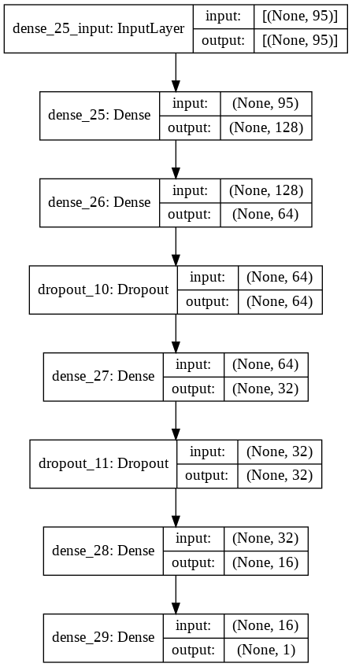
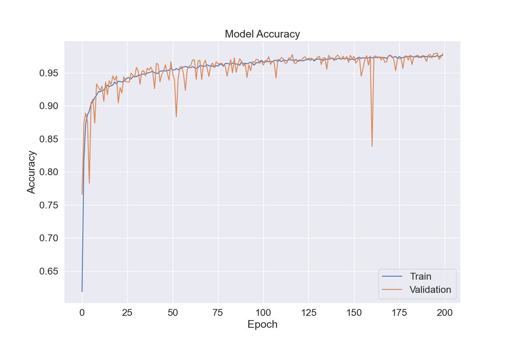

# Deep-Learning-Company-Bankruptcy-Prediction

The objective of the project is to perform the classification of companies bankrupt using Deep Learning. The dataset is taken from [kaggle](https://www.kaggle.com/fedesoriano/company-bankruptcy-prediction) and it contains the data of some companies with a column that indicates if the company is bankrupt or not.

This readme will explain the dataset structure, how the project works and the best network achieved so far.

# Index

- [Project structure](#project-structure)
- [Dataset structure](#dataset-structure)
- [How the project works](#how-the-project-works)
  * [Dataset download and import](#dataset-download-and-import)
  * [Dataset analysis](#dataset-analysis)
    + [Shape](#shape)
    + [Null Values](#null-values)
    + [Balance](#balance)
    + [Check Values](#check-values)
  * [Data Normalization](#data-normalization)
  * [Balance Dataset](#balance-dataset)
  * [Split data into training, validation and test set](#split-data-into-training--validation-and-test-set)
  * [Network creation](#network-creation)
    + [Options](#options)
    + [Network Creation and Training](#network-creation-and-training)
    + [Network Evaluate](#network-evaluate)
    + [Save Model](#save-model)
- [Best model analysis](#best-model-analysis)
  * [Network structure](#network-structure)
  * [Model Loss](#model-loss)
  * [Model Accuracy](#model-accuracy)
  * [Test set performance](#test-set-performance)
    + [Confusion Matrix](#confusion-matrix)

# Project structure
```
.
|
| Folders
├── data   # Folder with the dataset
│   └── data.zip
├── img   # Images of the graphs for the analysis report
|
| Notebook
└── Company_Bankruptcy_Prediction.ipynb
```

# Dataset structure

The data were collected from the Taiwan Economic Journal for the years 1999 to 2009. Company bankruptcy was defined based on the business regulations of the Taiwan Stock Exchange.

The columns of the dataset are the following:

* Y - Bankrupt?: Class label
* X1 - ROA(C) before interest and depreciation before interest: Return On Total Assets(C)
* X2 - ROA(A) before interest and % after tax: Return On Total Assets(A)
* X3 - ROA(B) before interest and depreciation after tax: Return On Total Assets(B)
* X4 - Operating Gross Margin: Gross Profit/Net Sales
* X5 - Realized Sales Gross Margin: Realized Gross Profit/Net Sales
* X6 - Operating Profit Rate: Operating Income/Net Sales
* X7 - Pre-tax net Interest Rate: Pre-Tax Income/Net Sales
* X8 - After-tax net Interest Rate: Net Income/Net Sales
* X9 - Non-industry income and expenditure/revenue: Net Non-operating Income Ratio
* X10 - Continuous interest rate (after tax): Net Income-Exclude Disposal Gain or Loss/Net Sales
* X11 - Operating Expense Rate: Operating Expenses/Net Sales
* X12 - Research and development expense rate: (Research and Development Expenses)/Net Sales
* X13 - Cash flow rate: Cash Flow from Operating/Current Liabilities
* X14 - Interest-bearing debt interest rate: Interest-bearing Debt/Equity
* X15 - Tax rate (A): Effective Tax Rate
* X16 - Net Value Per Share (B): Book Value Per Share(B)
* X17 - Net Value Per Share (A): Book Value Per Share(A)
* X18 - Net Value Per Share (C): Book Value Per Share(C)
* X19 - Persistent EPS in the Last Four Seasons: EPS-Net Income
* X20 - Cash Flow Per Share
* X21 - Revenue Per Share (Yuan ¥): Sales Per Share
* X22 - Operating Profit Per Share (Yuan ¥): Operating Income Per Share
* X23 - Per Share Net profit before tax (Yuan ¥): Pretax Income Per Share
* X24 - Realized Sales Gross Profit Growth Rate
* X25 - Operating Profit Growth Rate: Operating Income Growth
* X26 - After-tax Net Profit Growth Rate: Net Income Growth
* X27 - Regular Net Profit Growth Rate: Continuing Operating Income after Tax Growth
* X28 - Continuous Net Profit Growth Rate: Net Income-Excluding Disposal Gain or Loss Growth
* X29 - Total Asset Growth Rate: Total Asset Growth
* X30 - Net Value Growth Rate: Total Equity Growth
* X31 - Total Asset Return Growth Rate Ratio: Return on Total Asset Growth
* X32 - Cash Reinvestment %: Cash Reinvestment Ratio
* X33 - Current Ratio
* X34 - Quick Ratio: Acid Test
* X35 - Interest Expense Ratio: Interest Expenses/Total Revenue
* X36 - Total debt/Total net worth: Total Liability/Equity Ratio
* X37 - Debt ratio %: Liability/Total Assets
* X38 - Net worth/Assets: Equity/Total Assets
* X39 - Long-term fund suitability ratio (A): (Long-term Liability+Equity)/Fixed Assets
* X40 - Borrowing dependency: Cost of Interest-bearing Debt
* X41 - Contingent liabilities/Net worth: Contingent Liability/Equity
* X42 - Operating profit/Paid-in capital: Operating Income/Capital
* X43 - Net profit before tax/Paid-in capital: Pretax Income/Capital
* X44 - Inventory and accounts receivable/Net value: (Inventory+Accounts Receivables)/Equity
* X45 - Total Asset Turnover
* X46 - Accounts Receivable Turnover
* X47 - Average Collection Days: Days Receivable Outstanding
* X48 - Inventory Turnover Rate (times)
* X49 - Fixed Assets Turnover Frequency
* X50 - Net Worth Turnover Rate (times): Equity Turnover
* X51 - Revenue per person: Sales Per Employee
* X52 - Operating profit per person: Operation Income Per Employee
* X53 - Allocation rate per person: Fixed Assets Per Employee
* X54 - Working Capital to Total Assets
* X55 - Quick Assets/Total Assets
* X56 - Current Assets/Total Assets
* X57 - Cash/Total Assets
* X58 - Quick Assets/Current Liability
* X59 - Cash/Current Liability
* X60 - Current Liability to Assets
* X61 - Operating Funds to Liability
* X62 - Inventory/Working Capital
* X63 - Inventory/Current Liability
* X64 - Current Liabilities/Liability
* X65 - Working Capital/Equity
* X66 - Current Liabilities/Equity
* X67 - Long-term Liability to Current Assets
* X68 - Retained Earnings to Total Assets
* X69 - Total income/Total expense
* X70 - Total expense/Assets
* X71 - Current Asset Turnover Rate: Current Assets to Sales
* X72 - Quick Asset Turnover Rate: Quick Assets to Sales
* X73 - Working capitcal Turnover Rate: Working Capital to Sales
* X74 - Cash Turnover Rate: Cash to Sales
* X75 - Cash Flow to Sales
* X76 - Fixed Assets to Assets
* X77 - Current Liability to Liability
* X78 - Current Liability to Equity
* X79 - Equity to Long-term Liability
* X80 - Cash Flow to Total Assets
* X81 - Cash Flow to Liability
* X82 - CFO to Assets
* X83 - Cash Flow to Equity
* X84 - Current Liability to Current Assets
* X85 - Liability-Assets Flag: 1 if Total Liability exceeds Total Assets, 0 otherwise
* X86 - Net Income to Total Assets
* X87 - Total assets to GNP price
* X88 - No-credit Interval
* X89 - Gross Profit to Sales
* X90 - Net Income to Stockholder's Equity
* X91 - Liability to Equity
* X92 - Degree of Financial Leverage (DFL)
* X93 - Interest Coverage Ratio (Interest expense to EBIT)
* X94 - Net Income Flag: 1 if Net Income is Negative for the last two years, 0 otherwise
* X95 - Equity to Liability

The first row indicates with a 0 no bankrupt and with a 1 the bankrupt.

# How the project works

This section will show how the project works.

## Dataset download and import
In the first part of the code there will be the download of the dataset from github or from kaggle. In the second case it's important to insert in the corret folder the api token. In this [link](https://www.kaggle.com/docs/api) there's a guide on how to create a token.

Next using pandas the dataset will be inserted in a pandas dataframe.

## Dataset analysis
In the next part there will be an analysis of the dataset.

### Shape
The first thing done is to check the shape of the dataframe: **(6819,96)**

### Null Values
The second thing is to check if there are null values. Fortunately there aren't null values.

### Balance
Next it's important to check the balance of the dataset, because if there is a class that has more rows than the other the classification will have a good accuracy but it won't perform well on the minor class.

| Class | Number | Percentage |
|:-----:|:------:|:----------:|
|   0   |  6599  |   96.77 %  |
|   1   |  220   |   3.23 %   |


So the dataset is strongly unbalanced, the bankrupt class is only 3.27%. This means that there will be a step in which using SMOTE the dataset will be balanced.

### Check Values
It is important also to check if all the data are normalized. So if the code finds some values that are bigger than 1 and lower than 0, a normalization step will be performed. Unfortunately the dataset isn't all normalized.

## Data Normalization
In this section there will be the nomalization of the values. This process will use the ```StandardScaler()```. This scaler uses the mean and the standard deviation to set all values to between 0 and 1.

## Balance Dataset
The dataset has been balanced using [**SMOTE**](https://towardsdatascience.com/applying-smote-for-class-imbalance-with-just-a-few-lines-of-code-python-cdf603e58688) (Synthetic Minority Oversampling Technique).

The dataset will be filled with new data and it will be balanced.

The new shape is **(13198,96)**

| Class | Number | Percentage |
|:-----:|:------:|:----------:|
|   0   |  6599  |    50.0 %  |
|   1   |  6599  |    50.0 %  |


Now the dataset can be used with the networks.

## Split data into training, validation and test set

Split the data in:
* ```x_train```: The training set data
* ```y_train```: The training set label
* ```x_valid```: The validation set data
* ```y_valid```: The validation set label
* ```x_test```: The validation set data
* ```y_test```: The validation set label

The dimension will be something like

| Set | Percentage | Rows |
|:---:|:----------:|:----:|
|Training| 70 % | 9502 |
| Validation | 20 % | 2376 |
| Test | 10 % | 1320 |

## Network creation
In the code there is a section called **Create New Model** and it is helpful to create, train and evaluate a model.

### Options
In the first part of the section there are some boolean variables that tune what the code will do:

* ```train_model``` -> True: the network will be trained / False: network wont' be trained
* ```model_loss``` -> True: plot the model loss / False: don't plot the model loss
* ```model_accuracy``` -> True: plot the model accuracy / False: don't plot the model accuracy
* ```evaluate_model``` -> True: evaluate the model / False: don't evaluate the model
* ```conf_matr``` -> True: plot the confusion matrix / False: don't plot the confusion matrix
* ```plot_model``` -> True: plot the structure of the network / False: don't plot the structure of the network
* ```save_model``` -> True: save the model / False: don't save the model

### Network Creation and Training
After the variables tuning there is the network creation and training. 

### Network Evaluate
In this section there is the network evaluation. The code will plot useful data to understand how well the model is made and how it performs on the test set.

The plots will be:
* The model loss graph
* The model accuracy graph
* The performance of the test set
* The confusion matrix

### Save Model
At the end there is the possibility to save the model

# Best model analysis
In this section we will analyze the best model that we achieved.

## Network structure

The network used has this structure:



For each Dense layer except the last one there is **relu** as activation function. In the last Dense layer there is the **sigmoid** activation function.

In all Dense layer in the middle of the network there also the **l2 kernel regularizer** setted with (0.001).

The optimizer is **RMSprop** with the learning rate settet at 0.001.

The **loss function** is the binary crossentropy.

## Model Loss


As we can see there are some spikes in the Validation but overall it follows the Training loss. So there is no underfitting and no overfitting.

## Model Accuracy



As we can see there are some spikes in the accuracy but overall the Validation accuracy follows the Training accuracy. 

## Test set performance

In this section we will see how well the network perform on the training set.

| Accuracy | Loss |
|:--------:|:----:|
| 97.50 % | 0.1229|

| Class | Precision | Recall | f1-score | support |
|:-----:|:---------:|:------:|:--------:|:-------:|
| 0 | 1.00 | 0.95 | 0.98 | 688 |
| 1 | 0.95 | 1.00 | 0.97 | 632 |

### Confusion Matrix


As we can se only 33 values were misclassified.